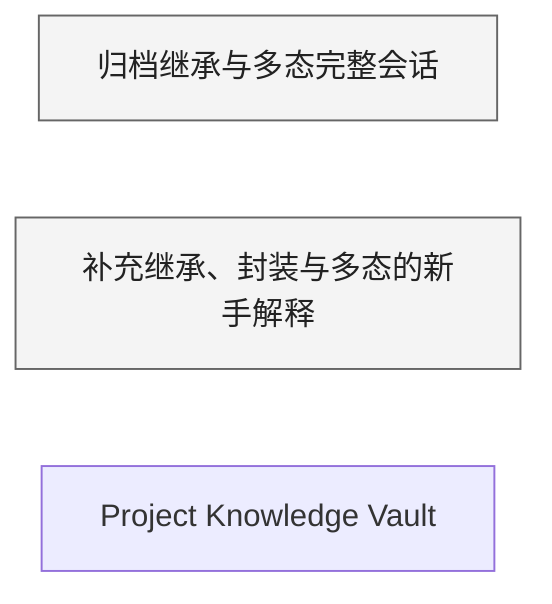

# Knowledge Graph

Generated on 2026-09-14. Obsidian users can also use the native graph view.

```mermaid
graph LR
    n0["归档继承与多态完整会话"]
    class n0 session
    n1["补充继承、封装与多态的新手解释"]
    class n1 session
    n2["Project Knowledge Vault"]
    classDef session fill:#f4f4f4,stroke:#666,color:#222
    classDef topic fill:#e7f3ff,stroke:#2774a8,color:#13293d
    classDef decision fill:#fff2cc,stroke:#a67c00,color:#3d3000
    classDef runbook fill:#e5f5e0,stroke:#3a7d44,color:#173d1d
    classDef snippet fill:#f3e8ff,stroke:#7651a8,color:#2f1b47
    classDef archived fill:#eeeeee,stroke:#999,color:#555
```
