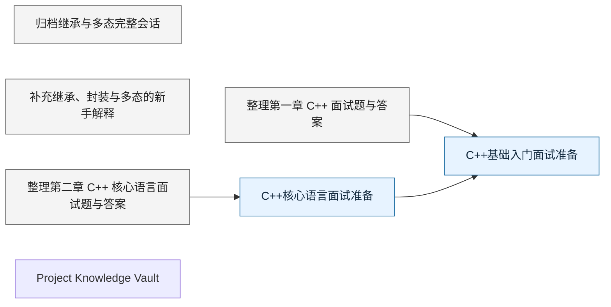

# Knowledge Graph

Generated on 2026-09-21. Obsidian users can also use the native graph view.

```mermaid
graph LR
    n0["归档继承与多态完整会话"]
    class n0 session
    n1["补充继承、封装与多态的新手解释"]
    class n1 session
    n2["整理第一章 C++ 面试题与答案"]
    class n2 session
    n3["整理第二章 C++ 核心语言面试题与答案"]
    class n3 session
    n4["C++基础入门面试准备"]
    class n4 topic
    n5["C++核心语言面试准备"]
    class n5 topic
    n6["Project Knowledge Vault"]
    n2 --> n4
    n3 --> n5
    n5 --> n4
    classDef session fill:#f4f4f4,stroke:#666,color:#222
    classDef topic fill:#e7f3ff,stroke:#2774a8,color:#13293d
    classDef decision fill:#fff2cc,stroke:#a67c00,color:#3d3000
    classDef runbook fill:#e5f5e0,stroke:#3a7d44,color:#173d1d
    classDef snippet fill:#f3e8ff,stroke:#7651a8,color:#2f1b47
    classDef archived fill:#eeeeee,stroke:#999,color:#555
```
