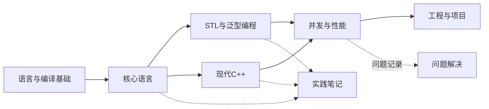

# C++ 学习知识库 - 主索引

## 学习目标

- [ ] 能阅读、编译和调试基础 C++ 程序
- [ ] 理解对象生命周期、资源所有权和 RAII
- [ ] 能正确使用 STL 容器、迭代器和算法
- [ ] 能使用现代 C++ 的移动语义、智能指针和泛型特性
- [ ] 能编写基础并发程序并识别数据竞争
- [ ] 能用 CMake、测试和调试工具完成小型项目

## 主线关系

## 学习阶段

| 阶段 | 状态 | 入口 |
|---|---|---|
| 01 基础入门 | 未开始 | [[01-基础入门/README]] |
| 02 核心语言 | 未开始 | [[02-核心语言/README]] |
| 03 STL 与泛型编程 | 未开始 | [[03-STL与泛型编程/README]] |
| 04 现代 C++ | 未开始 | [[04-现代C++/README]] |
| 05 并发与性能 | 未开始 | [[05-并发与性能/README]] |
| 08 工程与项目 | 未开始 | [[08-工程与项目/README]] |

## 辅助模块

- [[06-实践笔记/README]]
- [[07-问题解决/README]]
- [[使用指南]]

## 总体进度

- [ ] 第一阶段完成
- [ ] 第二阶段完成
- [ ] 第三阶段完成
- [ ] 第四阶段完成
- [ ] 第五阶段完成
- [ ] 工程阶段完成
