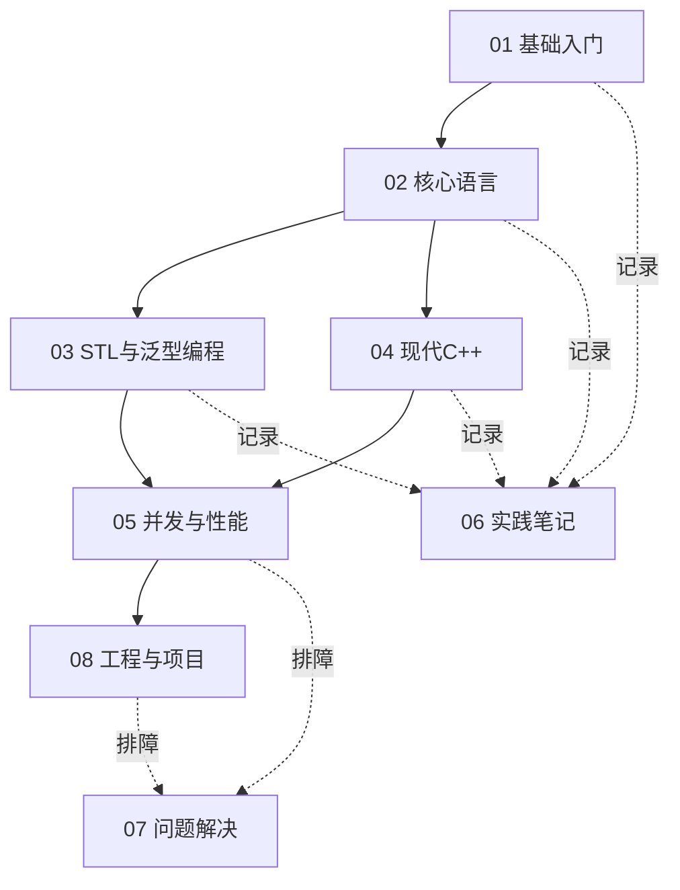

# C++ 学习关系图

```mermaid
flowchart TD
    A[01 基础入门] --> B[02 核心语言]
    B --> C[03 STL与泛型编程]
    B --> D[04 现代C++]
    C --> E[05 并发与性能]
    D --> E
    E --> F[08 工程与项目]
    A -.记录.-> G[06 实践笔记]
    B -.记录.-> G
    C -.记录.-> G
    D -.记录.-> G
    E -.排障.-> H[07 问题解决]
    F -.排障.-> H
```

## 关联

- [[README]]
- [[00-索引/README]]
